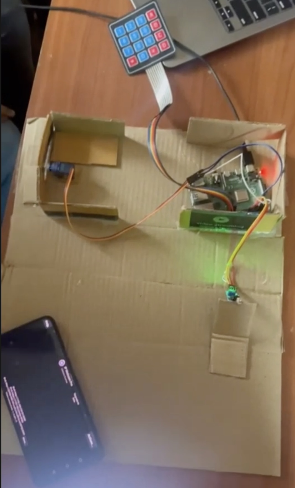

🔐 Dynamic Password Generation for Safe Lock System
This is our 4th semester project titled "Dynamic Password Generation for Safe Lock System", built using a Raspberry Pi and multiple connected sensors. The aim is to create a secure, power-efficient, and smart locking mechanism with remote access and surveillance capabilities.

🧠 Project Overview
Our system integrates a motion-based OTP (One-Time Password) server, an IR sensor for energy efficiency, a 4x4 keypad for secure input, a servo motor for gate control, and a smartphone-powered CCTV system. Below is a high-level breakdown of how the system works:

✅ Core Features
IR Sensor Activation:
The system remains idle to conserve power and only starts the OTP server when motion is detected via the IR sensor.

OTP Server:
Once activated, the server displays an OTP on a webpage accessible only for 30 seconds. Only approved IP addresses can view the OTP—others are shown an "Access Denied" message.

4x4 Keypad + Servo Motor:
The OTP must be entered on a physical 4x4 keypad. Upon correct entry, a servo motor rotates to unlock the gate and resets back after 30 seconds.

Smartphone CCTV Integration:
We’ve also implemented a lightweight CCTV system using a smartphone. The phone records video and uploads 20-second clips to a directory on the server using cameraphone.py.

🧰 Hardware Components
📷 Smartphone Camera (for CCTV recording)

🔢 4x4 Keypad (for OTP entry)

📡 IR Sensor (for motion detection)

🔗 Note: All devices must be connected to the same Wi-Fi network for smooth operation.

📁 Code Structure
ir.py – Handles IR sensor input

type1.py – Controls keypad and servo motor logic

cameraphone.py – Connects the smartphone to the Raspberry Pi for periodic video capture and storage

⚙️ Setup Instructions
Connect Sensors:

Refer to ir.py for wiring the IR sensor.

Refer to type1.py for connecting the 4x4 keypad and servo motor.

Make sure to connect the 5V and GND pins of the IR sensor and servo to the correct GPIO ports.
(Tip: Search "Raspberry Pi GPIO pinout" for reference.)

Run the System:

Start the IR script to monitor motion.

On motion detection, the OTP server will activate for 30 seconds.

Use your smartphone to access the OTP webpage if your IP is whitelisted.

Enter the OTP via the keypad to unlock the servo-controlled gate.

Enable CCTV Mode:

Launch cameraphone.py on your smartphone.

It will begin uploading video clips every 20 seconds to the server.

🧠 Learning Outcome
Through this project, we explored:

The powerful capabilities of the Raspberry Pi

Real-time interaction with multiple sensors

Concepts of network security and IP whitelisting

Combining hardware automation with software logic

We are excited to take this experience forward and build more innovative Raspberry Pi projects.

